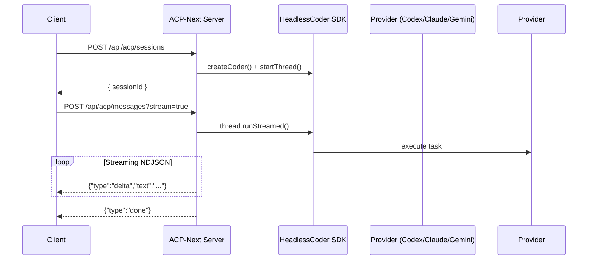

# 🚀 Headless Coder ACP Server

The **ACP Server** is a Next.js application that exposes the **Headless Coder SDK** via the [Agent Communication Protocol (ACP)](https://agentcommunicationprotocol.dev/introduction/welcome).  
It dynamically loads available adapters from `acp.config.json`, registers enabled providers (**Codex**, **Claude**, **Gemini**), and exposes ACP-compatible REST + streaming endpoints under `/api/acp/*`.

---

## ✨ Key Features

- ⚙️ **Dynamic provider configuration** using `acp.config.json`
- 🔄 **NDJSON streaming** for real-time AI-coder responses
- 🔐 Optional **Bearer token authentication** via `ACP_TOKEN`
- 🧠 **Structured output** support via JSON schemas
- 🧰 Unified interface across Codex, Claude, and Gemini adapters
- 🚀 Built with **Next.js (Node runtime)** — deploy anywhere

---

## 🧩 Prerequisites

- **Node.js 20+**
- Headless Coder SDK installed (`pnpm install` or `npm install` at repo root)
- Optional: environment variable `ACP_TOKEN` for authentication
- Provider-specific credentials available (e.g. Codex binary, Claude API key, Gemini CLI)

---

## ⚙️ Configuration

1. Open and edit `apps/acp-next/acp.config.json` to enable or disable adapters.  
   The config is validated against `acp.config.schema.json` at runtime.

   **Example:**
   ```json
   {
     "enabledAgents": ["codex", "gemini"],
     "defaults": {
       "workingDirectory": ".",
       "model": null,
       "sandboxMode": "read-only"
     }
   }
   ```

2. (Optional) To enforce authentication, add an `ACP_TOKEN` variable in your environment:
   ```bash
   ACP_TOKEN=my-secret-token
   ```
   Copy `.env.local.example` → `.env.local` and fill in your desired values.

---

## ▶️ Running the Server

From the repository root:

```bash
# Start the ACP server on port 8000
pnpm --filter acp-next dev
# or
npm run dev --workspace acp-next
```

Once started, the API will serve the following routes:

| Method | Endpoint | Description |
|---------|-----------|-------------|
| **GET** | `/api/acp/agents` | Lists enabled agents defined in `acp.config.json`. |
| **POST** | `/api/acp/sessions` | Creates a new Headless Coder thread/session. |
| **POST** | `/api/acp/messages?stream=true` | Streams Headless Coder events as NDJSON frames. |

**Sample NDJSON stream output:**
```json
{"type":"delta","text":"Hello world!"}
{"type":"done"}
```

---

## 🏗️ Building and Deploying

```bash
pnpm --filter acp-next build
pnpm --filter acp-next start
```

### Deployment options
- **Vercel** — ideal for quick serverless deployment (`runtime: nodejs` required).  
- **Docker** — portable containerized deployment.  
- **Render / Fly.io / AWS** — any Node 20+ runtime will work.

Make sure your deployment includes:
- `ACP_TOKEN` (if auth required)
- Correct provider credentials (Codex CLI, Claude, Gemini)

---

## 🧪 Testing & Client Example

An example TypeScript client is available under `apps/acp-next/client`.

### Run built-in tests
```bash
pnpm --filter acp-next dev   # start server
pnpm run acp:e2e             # execute client integration tests
```

The E2E test:
1. Calls `GET /api/acp/agents`
2. Opens a session for the first provider
3. Sends a structured output request
4. Streams and validates NDJSON frames

### Minimal standalone client

```ts
import fetch from 'node-fetch';

const BASE_URL = process.env.ACP_BASE_URL ?? 'http://localhost:8000';
const headers = process.env.ACP_TOKEN
  ? { Authorization: `Bearer ${process.env.ACP_TOKEN}`, 'Content-Type': 'application/json' }
  : { 'Content-Type': 'application/json' };

async function main() {
  const agents = await (await fetch(`${BASE_URL}/api/acp/agents`, { headers })).json();
  const provider = agents.agents[0].id;

  const session = await (await fetch(`${BASE_URL}/api/acp/sessions`, {
    method: 'POST',
    headers,
    body: JSON.stringify({ provider }),
  })).json();

  const schema = {
    type: 'object',
    properties: {
      summary: { type: 'string' },
      risks: { type: 'array', items: { type: 'string' }, minItems: 1 },
    },
    required: ['summary', 'risks'],
  };

  const response = await fetch(`${BASE_URL}/api/acp/messages?stream=true`, {
    method: 'POST',
    headers,
    body: JSON.stringify({
      sessionId: session.sessionId,
      content: 'Review the latest commit and explain key risks.',
      outputSchema: schema,
    }),
  });

  const reader = response.body!.getReader();
  const decoder = new TextDecoder();
  while (true) {
    const { done, value } = await reader.read();
    if (done) break;
    process.stdout.write(decoder.decode(value));
  }
}

main().catch(console.error);
```

---

## 📊 API Flow Overview



---

## 🛠️ Development Notes

- **Dynamic imports** ensure only enabled adapters are bundled.
- Routes export `runtime = 'nodejs'` for CLI-based adapters (Codex, Gemini).
- Sessions are in-memory by default; add Redis/Postgres for persistence.
- Works with official ACP SDK clients (e.g. BeeAI, Zed).

---

## 🧾 License

MIT © 2025 [Ohad Assulin](https://github.com/OhadAssulin)

---

### 🤝 Contributing

Pull requests and issues are welcome!  
If you encounter a bug or have ideas for improvement, open an issue on GitHub:
👉 [https://github.com/OhadAssulin/headless-coder-sdk/issues](https://github.com/OhadAssulin/headless-coder-sdk/issues)
